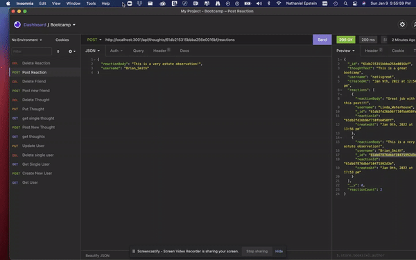
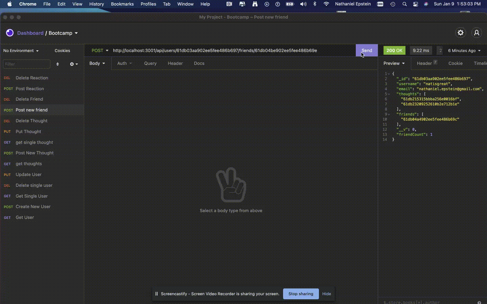
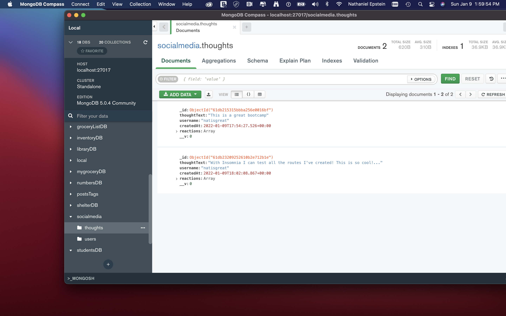
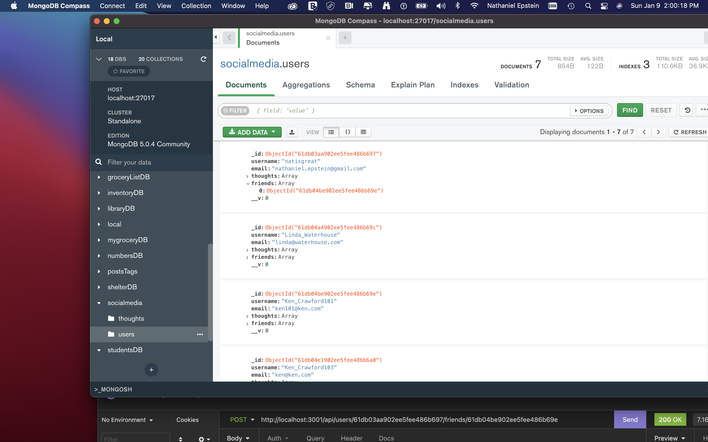

# Social-Network-API

  
  ## Description 
  This is a program that allows the user to maintain a backend social network database through MONGODB. Users can retrieve, create, update and delete thoughts and users and can create and delete new reactions to posts and even add and delete friends! . 

  ## Table of Contents
  * [Installation](#installation)
  * [Usage](#usage)
  * [License](#license)
  * [Questions](#questions)
  * [Media](#media)

  
  ## Installation 
  The User Must install node first. Then they must install express (to run the server) and mongoose to use the mongoose ODM.
  ## Usage 
  You will need to run npm init -y and npm i express and npm i mongoose. 
  ## License 
  This project is license under MIT License
  

  ## Questions
  If you have any questions about this projects, please contact me directly at nathaniel.epstein@gmail.com. You can view more of my projects at https://github.com/natpitt2393.

  ## Media
  
  
  
  
  
  
  
  
  